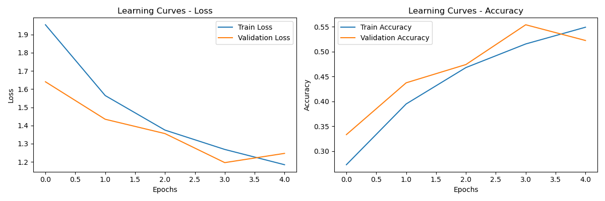

# Facial Emotion Detection Project

This project implements a system for detecting emotions from facial expressions using Convolutional Neural Networks (CNN). The system can recognize 7 different emotions: Happiness, Sadness, Anger, Surprise, Fear, Disgust, and Neutral.

## Table of Contents

1. [Overview](#overview)
2. [Project Structure](#project-structure)
3. [Installation](#installation)
4. [Usage](#usage)
5. [Technical Approach](#technical-approach)
6. [Results](#results)
7. [Advanced Features](#advanced-features)
8. [Possible Improvements](#possible-improvements)

## Overview

This project was developed as part of a study on real-time facial emotion recognition. It combines computer vision techniques for face detection and deep neural networks for emotion classification. The system can:

- Detect a face in a video stream
- Preprocess the face image
- Classify the emotion in real-time
- Generate adversarial examples (advanced feature)

## Project Structure

```
project/
├── data/
│   ├── test.csv
│   ├── train.csv
│   └── test_with_emotions.csv
├── requirements.txt
├── README.md
├── results/
│   ├── model/
│   │   ├── learning_curves.png
│   │   ├── final_emotion_model_arch.txt
│   │   ├── final_emotion_model.keras
│   │   └── confusion_matrix.png
│   ├── preprocessing_test/
│   │   ├── image0.png
│   │   ├── image1.png
│   │   └── input_video.mp4
│   └── adversarial/
│       ├── adversarial_attack.png
│       ├── original.png
│       └── adversarial.png
└── scripts/
    ├── validation_loss_accuracy.py
    ├── predict_live_stream.py
    ├── predict.py
    ├── preprocess.py
    ├── train.py
    └── hack_cnn.py
```

## Installation

To install and configure the project:

```bash
# Clone the repository
git clone https://github.com/your-username/emotion-detection.git
cd emotion-detection

# Install dependencies
pip install -r requirements.txt
```

### Prerequisites

- Python 3.7+
- TensorFlow 2.x
- OpenCV
- numpy
- matplotlib
- scikit-learn
- seaborn (optional, for visualizations)

## Usage

### 1. Downloading the dataset
Make sure to give execution permissions to the download_data.sh file then:
```bash
./download_data.sh
```

### 2. Training the model

To train the CNN emotion detection model:

```bash
python scripts/train.py
```

The trained model will be saved in `final_emotion_model.keras`.

### 3. Model evaluation

To evaluate the model's performance on the test set:

```bash
python scripts/predict.py
```

Expected output:
```
Accuracy on test set: 62% (a value higher than 60 is required)
```

### 4. Real-time emotion detection

To launch emotion detection from the webcam video stream:

```bash
python scripts/predict_live_stream.py
```

Expected output:
```
Reading video stream ...

Preprocessing ...
11:11:11s : Happy , 73%

Preprocessing ...
11:11:12s : Happy , 93%

...
```

### 5. Generating adversarial examples (advanced feature)

To generate an adversarial example that fools the model:

```bash
python scripts/hack_cnn.py
```

The results will be saved in `results/adversarial/`.

## Technical Approach

### Data Preprocessing

1. Face images are resized to 48x48 pixels
2. Conversion to grayscale
3. Normalization of pixel values between 0 and 1
4. Using OpenCV for face detection in the video stream
5. Data augmentation during training to improve generalization

### CNN Model Architecture

Our CNN architecture includes:

- 3 convolution blocks (with BatchNormalization and MaxPooling)
- Dropout layers to reduce overfitting
- Dense layers for final classification
- Softmax activation function at the output for predicting the 7 emotion classes

The complete architecture is detailed in `results/model/final_emotion_model_arch.txt`.

### Training

- Optimizer: Adam with adaptive learning rate
- Loss function: Categorical Crossentropy
- Early stopping to prevent overfitting
- Monitoring with TensorBoard
- GPU support to accelerate training

## Results





### Distribution of Predictions by Class

The model performs well on distinctive emotions like happiness and surprise, but has more difficulty distinguishing between fear and sadness.

## Advanced Features

### Adversarial Attack

The `hack_cnn.py` script implements an adversarial attack technique that demonstrates an interesting vulnerability of neural networks. It allows:

1. Selecting an image classified as "Happy" with high confidence (>90%)
2. Subtly modifying the pixels of the image so that the model classifies it as "Sad"
3. The modifications are imperceptible to the human eye but sufficient to fool the model

This feature illustrates the importance of robustness in deep learning models against adversarial attacks.


## Possible Improvements

- Using pre-trained models (transfer learning) to improve accuracy
- Implementation of attention techniques to better focus on expressive facial regions
- Deployment on mobile devices (TensorFlow Lite)
- Integration with other modalities (audio) for multimodal emotion recognition
- Improving robustness against adversarial attacks
